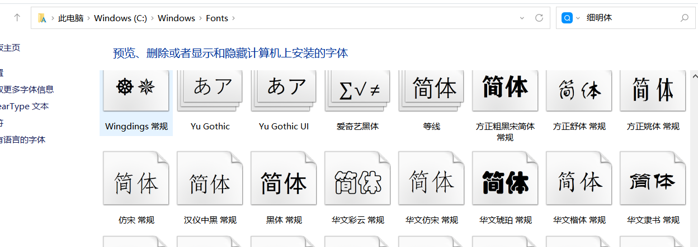

1. 字体
2. 字体图标
3. 样式
4. 屏幕尺寸386*732
5. 先实现图片

先在主页里实现读取indexdb里的数据并把图片展示到界面上

文字内容用一个对象存储 ui全部用text格式，日期就加一个 例：2000年3月15日
写的时候先存一个，先把一个的逻辑写好。
先不要紧着写那么多
就先存一个姓名和照片，把这个逻辑完成就好些了，其他全都一样。

字体问题

为什么电脑上明明设置了字体，手机上依然看不到呢？
答案就是手机上没有微软雅黑等类似的字体。
电脑上装了所以电脑上能看到

所以我们应该自己定义字体文件。
使用自己的字体文件

可以用阿里巴巴的字体库。

明天再搞，今天先不搞，关键点就是下载一套字体，用自定义字体去导入使用

1. 真正展示出来的字体在这里显示

2. 可以查看系统已安装的字体，在这里

加载慢问题
考虑加个缓存